# Catalogue visuel des composants

*Genere par `outils/generer_apercus.py` — ne pas editer a la main.*

A quoi ressemble chaque composant, variante par variante. Le Designer
(A6) choisit ici **en regardant**, pas en devinant a partir d'un nom.
Les images passent par la composition de rendu reelle : c'est ce que la
video montrera, tokens de charte compris.

Images prises a la frame 30 (~1.0 s), donc apres
l'animation d'entree.

Pour regenerer apres avoir cree ou modifie un composant :

```bash
python3 outils/generer_apercus.py
```

## ConceptCutaway

### llm-single-turn


- Parametres : `scene` = `llm_single_turn`, `label` = `STEP 1 — LLM`

### workflow-tools


- Parametres : `scene` = `workflow_tools`, `label` = `STEP 2 — AI WORKFLOW`

### workflow-fixed-path


- Parametres : `scene` = `workflow_fixed_path`, `label` = `FIXED PATH`

### agent-loop


- Parametres : `scene` = `agent_loop`, `label` = `STEP 3 — AI AGENT`

### github-demo


- Parametres : `scene` = `github_demo`, `label` = `CLAUDE + GITHUB`

### context7-demo

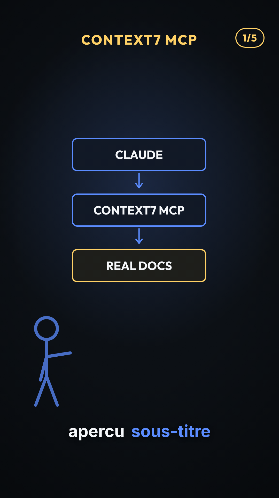

- Parametres : `scene` = `context7_demo`, `label` = `CONTEXT7 MCP`, `compteur` = `1/5`

### playwright-demo

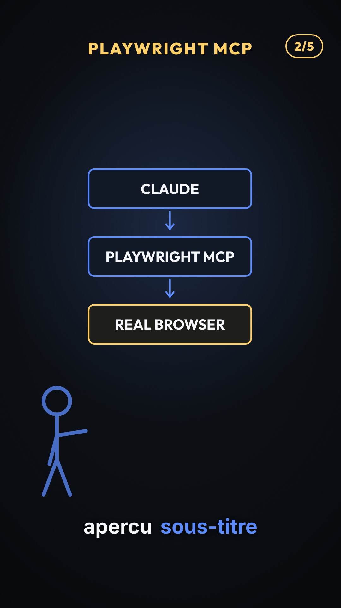

- Parametres : `scene` = `playwright_demo`, `label` = `PLAYWRIGHT MCP`, `compteur` = `2/5`

### firecrawl-demo

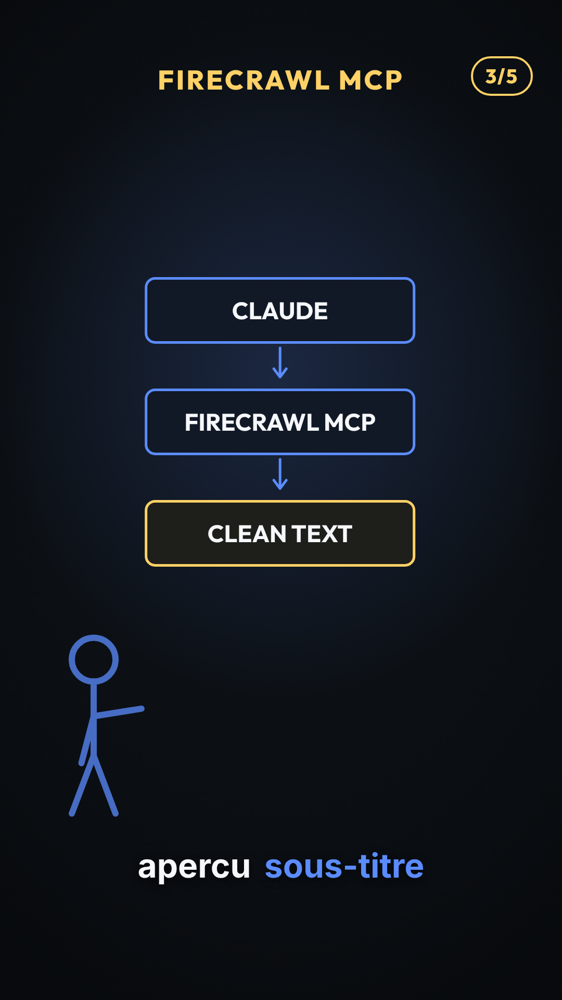

- Parametres : `scene` = `firecrawl_demo`, `label` = `FIRECRAWL MCP`, `compteur` = `3/5`

### higgsfield-demo

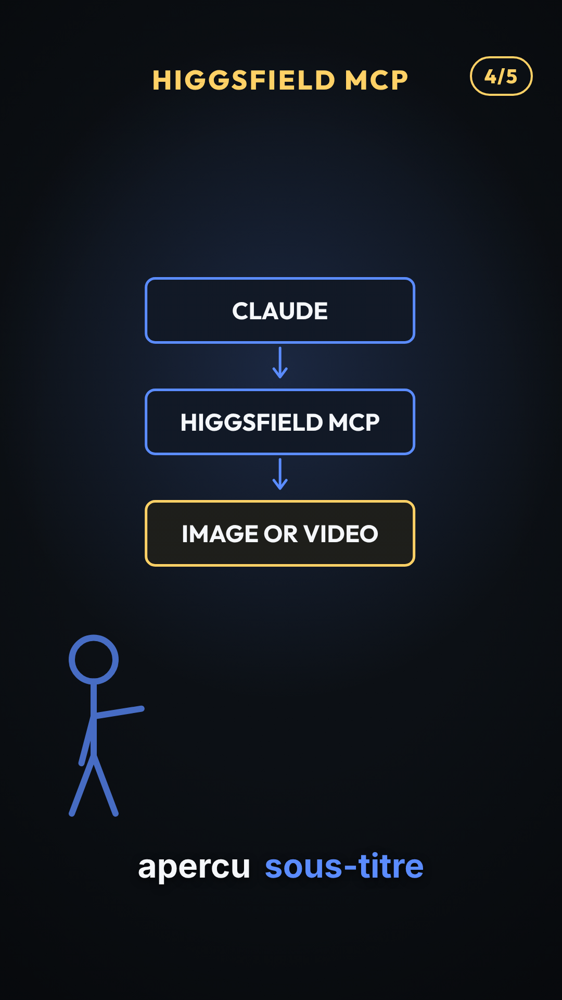

- Parametres : `scene` = `higgsfield_demo`, `label` = `HIGGSFIELD MCP`, `compteur` = `4/5`

### github-mcp-demo

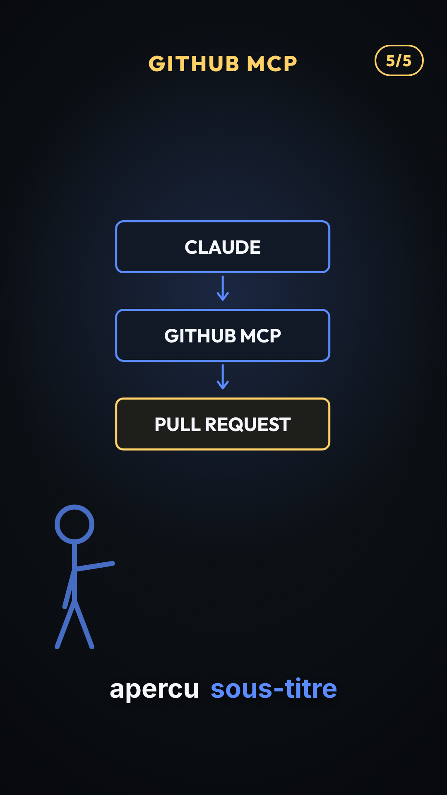

- Parametres : `scene` = `github_mcp_demo`, `label` = `GITHUB MCP`, `compteur` = `5/5`

## PlanBroll

### photo-accroche

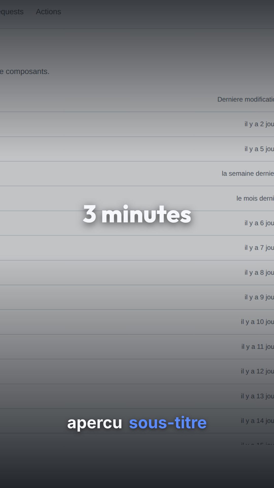

- Parametres : `broll` = `fond`, `accroche` = `3 minutes`

## PlanCapture

### capture-seule

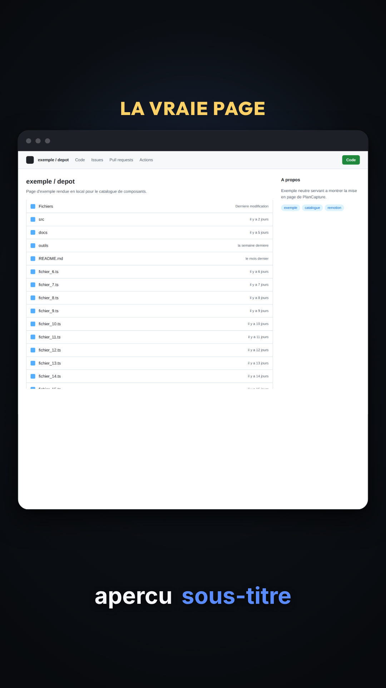

- Parametres : `capture` = `page`, `label` = `LA VRAIE PAGE`

### capture-logo-compteur

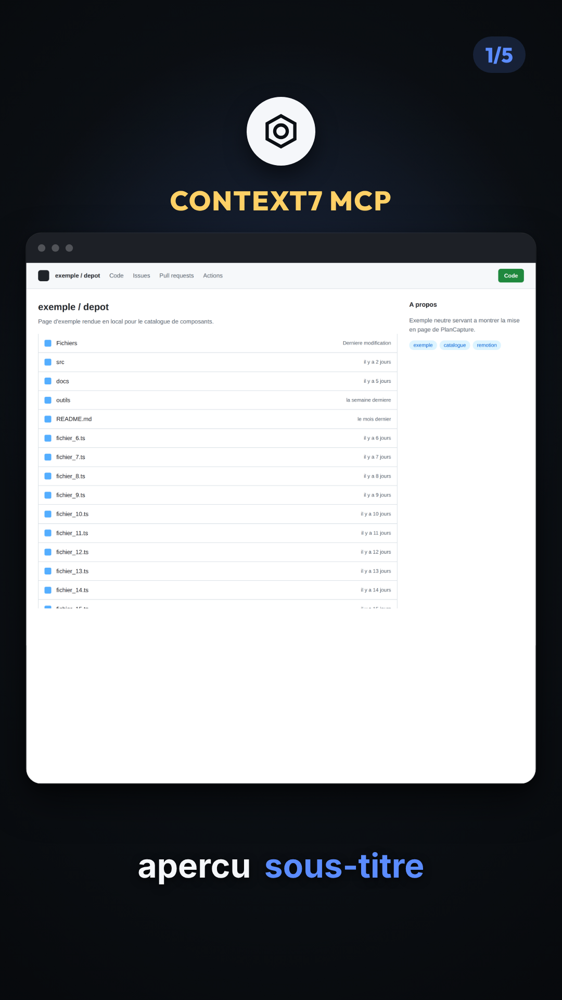

- Parametres : `capture` = `page`, `logo` = `marque`, `label` = `CONTEXT7 MCP`, `compteur` = `1/5`

### ressource-manquante

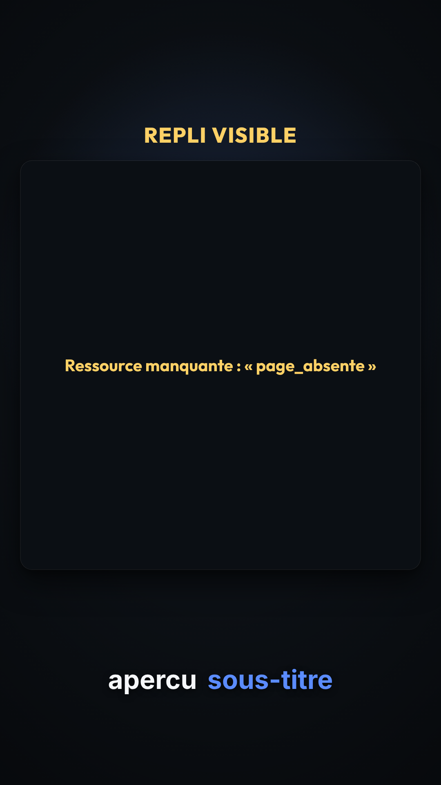

- Parametres : `capture` = `page_absente`, `label` = `REPLI VISIBLE`

## PlanDeuxTerminaux

### une-heure-contre-dix

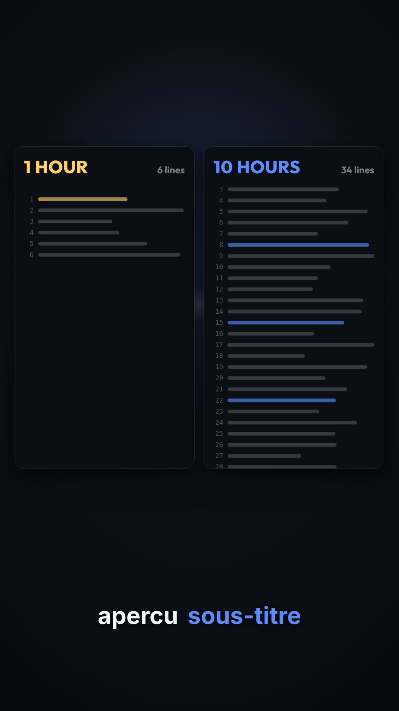

- Parametres : `gauche` = `{'titre': '1 HOUR', 'lignes': 6}`, `droite` = `{'titre': '10 HOURS', 'lignes': 34}`, `fond_flou` = `three settings`

## PlanListeSequencee

### echelle-effort

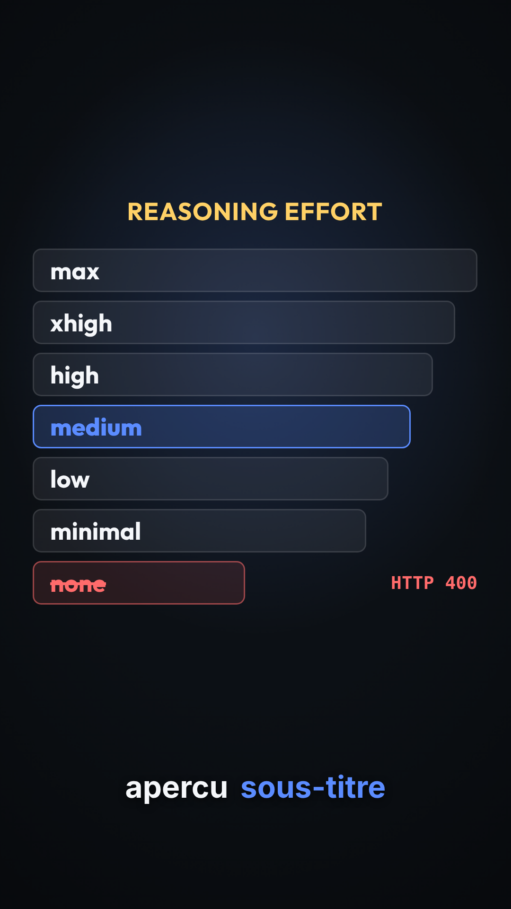

- Parametres : `titre` = `REASONING EFFORT`, `disposition` = `echelle`, `entrees` = `['none', 'minimal', 'low', 'medium', 'high', 'xhigh', 'max']`, `barree` = `none`, `mention_barree` = `HTTP 400`, `accentuee` = `medium`

### liste-contrat

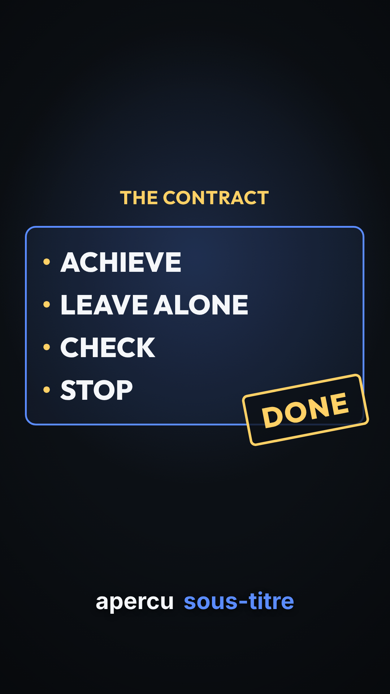

- Parametres : `titre` = `THE CONTRACT`, `disposition` = `liste`, `entrees` = `['ACHIEVE', 'LEAVE ALONE', 'CHECK', 'STOP']`, `cadre` = `True`, `tampon` = `DONE`

### deux-colonnes

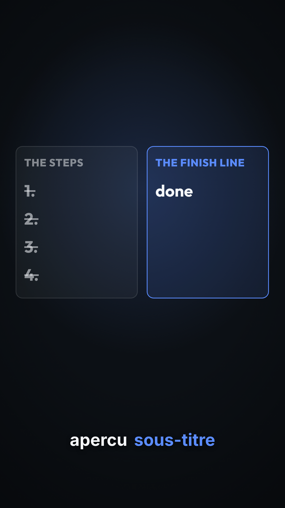

- Parametres : `disposition` = `deux_colonnes`, `colonne_gauche` = `{'titre': 'THE STEPS', 'entrees': ['1.', '2.', '3.', '4.'], 'effacee': True}`, `colonne_droite` = `{'titre': 'THE FINISH LINE', 'entrees': ['done']}`

## PlanLogos

### trois-logos-relies

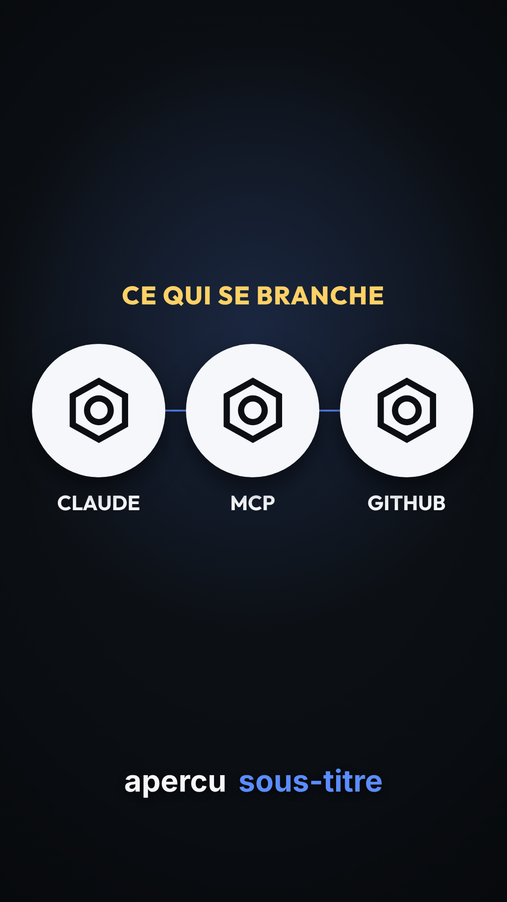

- Parametres : `label` = `CE QUI SE BRANCHE`, `logos` = `[{'cle': 'a', 'libelle': 'CLAUDE'}, {'cle': 'b', 'libelle': 'MCP'}, {'cle': 'c', 'libelle': 'GITHUB'}]`

## PlanNavigateurCurseur

### ouverture-liste

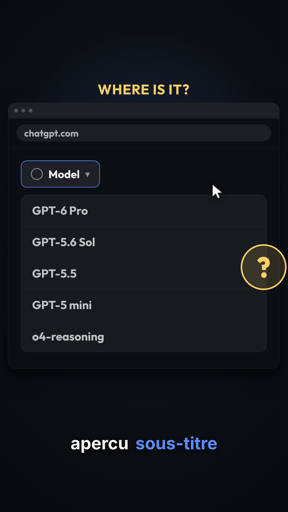

- Parametres : `etat` = `ouverture_liste`, `label` = `WHERE IS IT?`, `marqueur` = `question`, `zoom` = `liste`

### ligne-surlignee

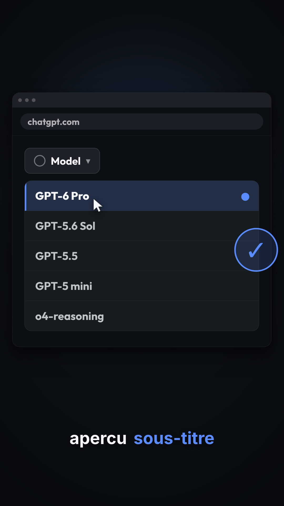

- Parametres : `etat` = `ligne_surlignee`, `surligne` = `GPT-6 Pro`, `marqueur` = `coche`

## PlanTerminalFrappe

### frappe-goal

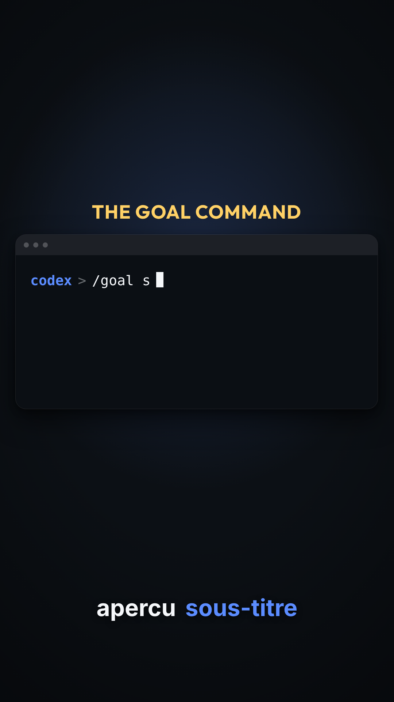

- Parametres : `invite` = `codex`, `frappe` = `/goal ship the migration and keep tests green`, `label` = `THE GOAL COMMAND`

### defilement-horloge

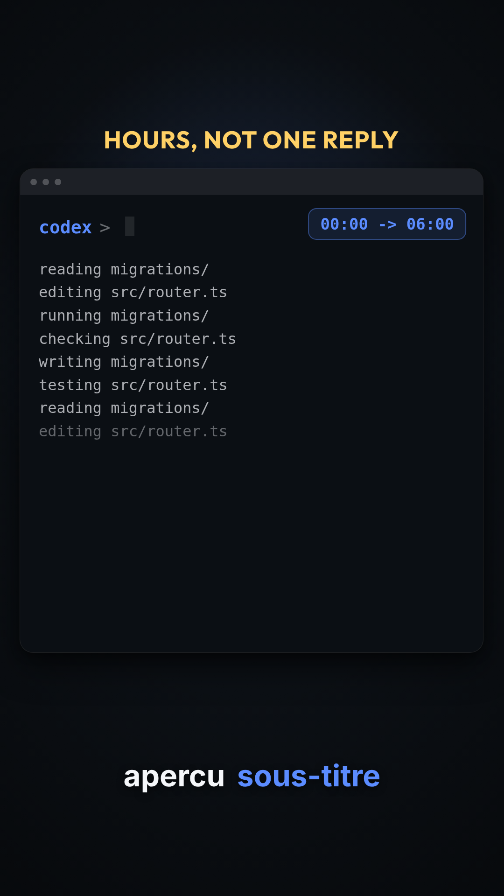

- Parametres : `invite` = `codex`, `defilement_auto` = `True`, `horloge` = `00:00 -> 06:00`, `label` = `HOURS, NOT ONE REPLY`

## StickmanTalk

### intro


- Parametres : `pose` = `intro`

### lean-in


- Parametres : `pose` = `lean_in`, `label` = `REAL EXAMPLE`

### outro


- Parametres : `pose` = `outro`

## TitleCard

### titre-seul


- Parametres : `texte` = `Most of them are not agents.`

### titre-et-sous-titre


- Parametres : `texte` = `What changed this week`, `sousTitre` = `AI news, decoded`
