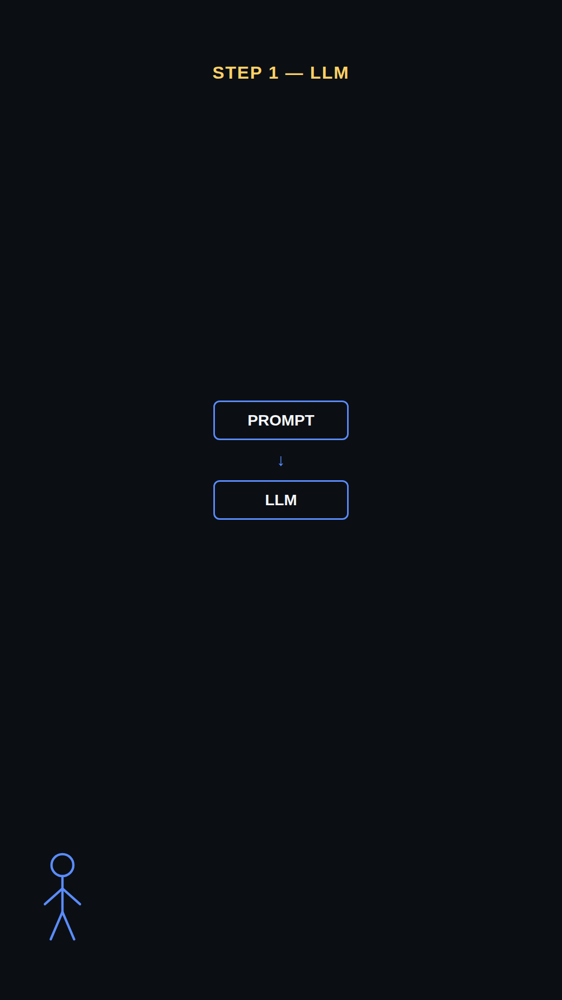
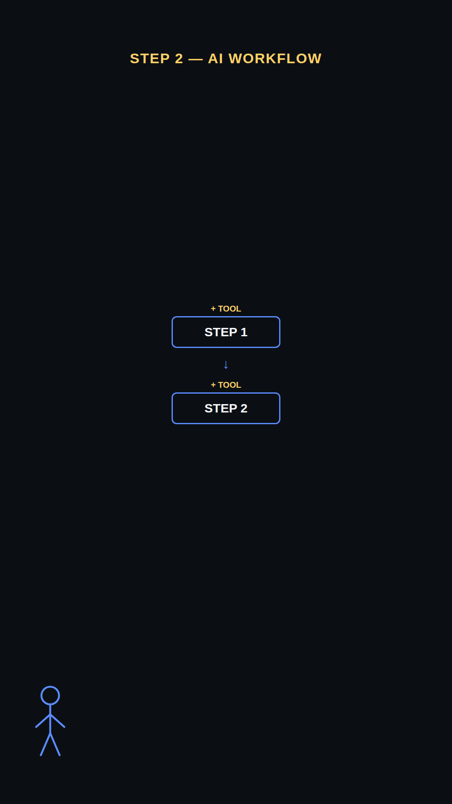
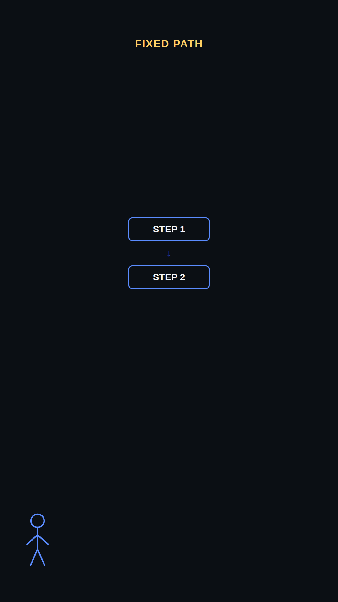
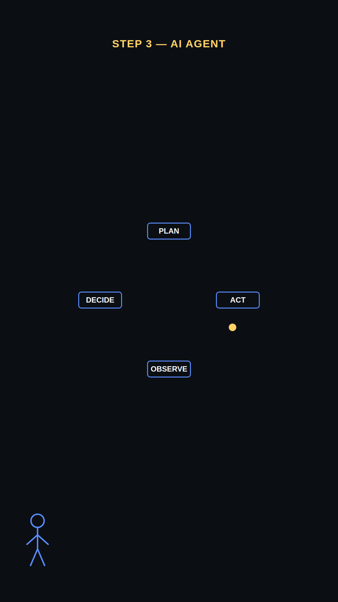
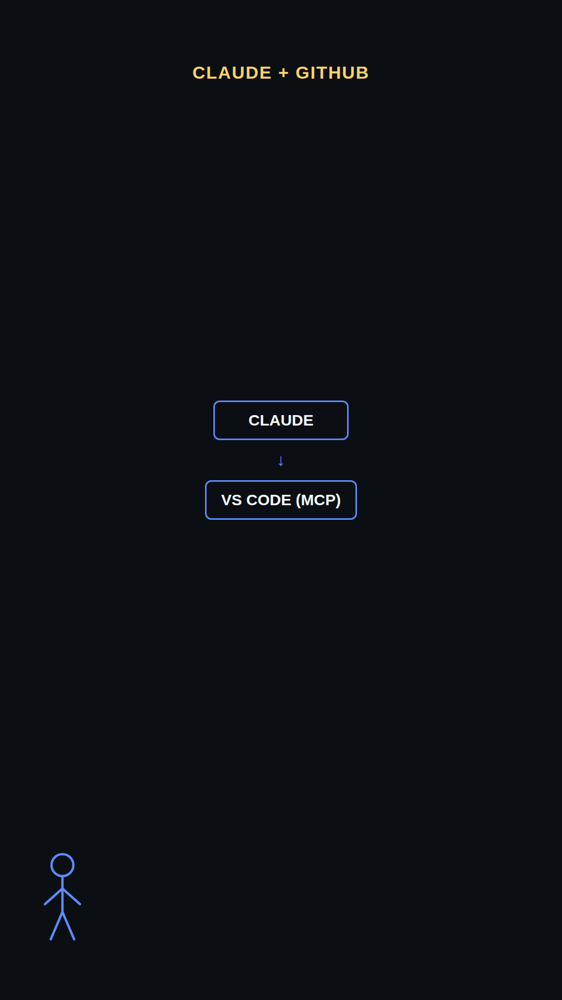
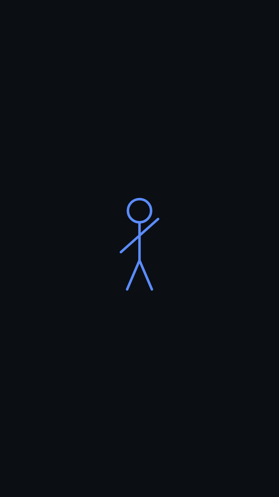
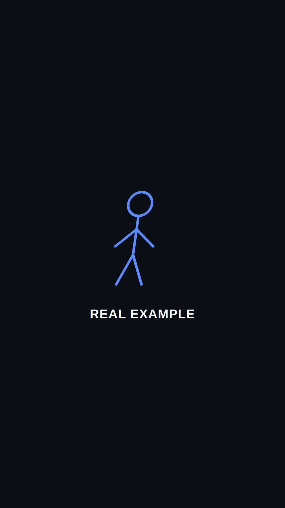
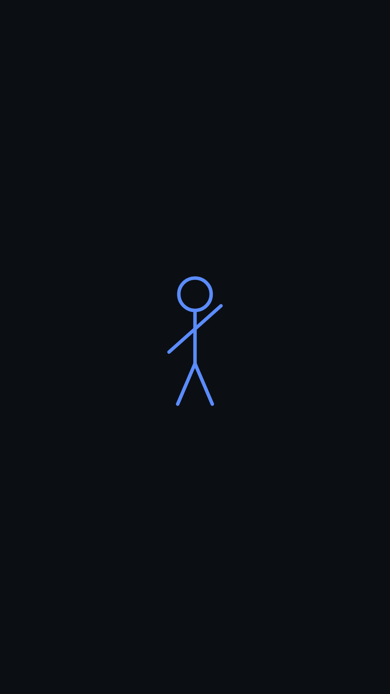
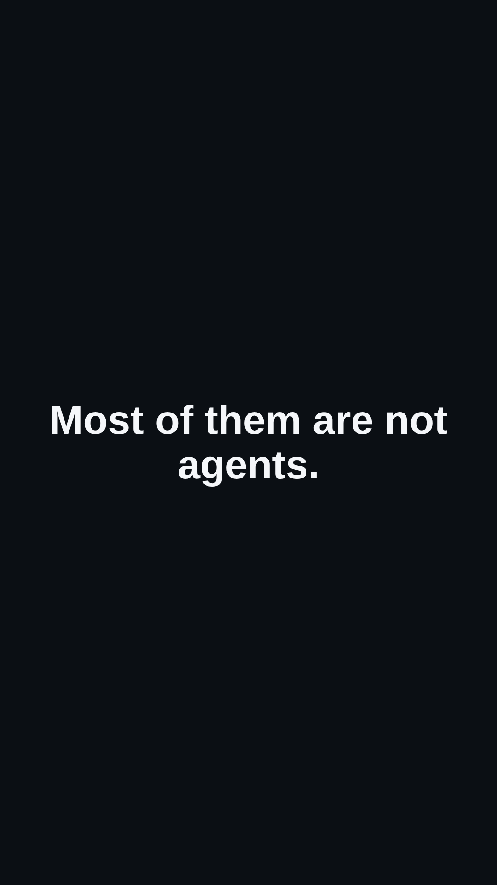

# Catalogue visuel des composants

*Genere par `outils/generer_apercus.py` — ne pas editer a la main.*

A quoi ressemble chaque composant, variante par variante. Le Designer
(A6) choisit ici **en regardant**, pas en devinant a partir d'un nom.
Les images passent par la composition de rendu reelle : c'est ce que la
video montrera, tokens de charte compris.

Images prises a la frame 30 (~1.0 s), donc apres
l'animation d'entree.

Pour regenerer apres avoir cree ou modifie un composant :

```bash
python3 outils/generer_apercus.py
```

## ConceptCutaway

### llm-single-turn



- Parametres : `scene` = `llm_single_turn`, `label` = `STEP 1 — LLM`

### workflow-tools



- Parametres : `scene` = `workflow_tools`, `label` = `STEP 2 — AI WORKFLOW`

### workflow-fixed-path



- Parametres : `scene` = `workflow_fixed_path`, `label` = `FIXED PATH`

### agent-loop



- Parametres : `scene` = `agent_loop`, `label` = `STEP 3 — AI AGENT`

### github-demo



- Parametres : `scene` = `github_demo`, `label` = `CLAUDE + GITHUB`

## StickmanTalk

### intro



- Parametres : `pose` = `intro`

### lean-in



- Parametres : `pose` = `lean_in`, `label` = `REAL EXAMPLE`

### outro



- Parametres : `pose` = `outro`

## TitleCard

### titre-seul



- Parametres : `texte` = `Most of them are not agents.`

### titre-et-sous-titre


- Parametres : `texte` = `What changed this week`, `sousTitre` = `AI news, decoded`
